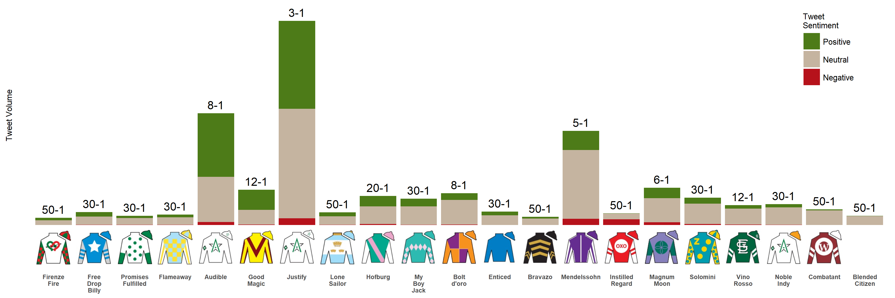

Analyzing the Social Media Buzz Surrounding the 2018 Kentucky Derby Contenders
================
Nick Holt, Ph.D.
May 4, 2018

Which Kentucky Derby horses are generating the most buzz?
=========================================================

Social media analytics provides a great way to understand the online conversation happening around a particular topic, or about your brand and it's competitors.

Using the latest in social listening technology, we thought it would be fun to take a look at the social media buzz surrounding each of the horses competing in 144th Kentucky Derby.

In this competitive analysis we used a powerful social listening tool called Crimson Hexagon to examine all of the tweets generated over the past 7 days that contain the name of an indivdual derby horse + the word "derby". We classified each tweet according to its sentiment, meaning we classified the conversation about a particular horse as positive, neutral, or negative. And finally, to add another layer of insight, we overlaid the morning line odds for each horse.

``` r
# 2018 Kentucky Derby (144th) - Social Listening Analytics Visualization Demo

# libraries
library(tidyverse)

# read in data
derby <- read_csv("derby_book_2018.csv")
colnames(derby) <- tolower(str_replace_all(colnames(derby), " ", "_"))
colnames(derby) <- str_replace_all(colnames(derby), "_tweets", "")

# reorder horse factor by post position so that the x axis follows post position
derby$horse <- factor(derby$horse, levels = c(derby$horse))

# gather tweet volume data into long format and capitalize sentiment tags
derby_clean <- derby %>% 
        gather(positive, negative, neutral, key = "sentiment", value = "tweet_count") %>%
        mutate(sentiment = str_to_title(sentiment))

# additional plot libraries
library(cowplot) # use cowplot to make a horse plot :)
library(magick)

# function to convert spaces in horse names into line breaks to prevent crowding of text
addline_format <- function(x,...){
        gsub('\\s','\n',x)
}

# minimal stacked bar plot
plot <- ggplot(arrange(derby_clean), aes(x = horse, y = tweet_count, fill = factor(sentiment, levels = c("Positive", "Neutral", "Negative")))) +
         geom_bar(stat = "identity", width=0.9) +
         scale_fill_manual(values = c("#4D7B18", "#C5B4A0", "#B6121B")) +
         theme_classic() +
         ylab("Tweet Volume\n") +
         guides(fill = guide_legend(title = "Tweet\nSentiment")) +
         theme(axis.text.x = element_text(angle = 0, size = 6, face = "bold"),
               legend.position = c(.93, .8),
               legend.text = element_text(size = 8),
               legend.title = element_text(size = 8),
               axis.title.y = element_text(size = 8),
               axis.line=element_blank(),
               axis.ticks = element_blank(),
               axis.text.y=element_blank(),
               axis.title.x = element_blank()) + 
         # a little trick to add the morning line odds to the tops of the corresponding bars
         geom_text(aes(horse, tweets_in_last_week, label = current_odds, fill = NULL), data = derby, position = position_dodge(width = .9), vjust = -.5) +
         scale_y_continuous(expand = c(0, 0), limits = c(0, 3250)) +
         scale_x_discrete(breaks=unique(derby$horse), 
                          labels=addline_format(unique(derby$horse)))

# draw the jockey silk images for the custom x axis
pimage <- axis_canvas(plot, axis = 'x') + 
         draw_image("Firenze Fire.jpg", x = 0.5, y = 0, scale = 0.9) +
         draw_image("Free Drop Billy.jpg", x = 1.5, scale = 0.9) +
         draw_image("Promises Fulfilled.jpg", x = 2.5, scale = 0.9) +
         draw_image("Flameaway.jpg", x = 3.5, scale = 0.9) +
         draw_image("Audible.jpg", x = 4.5, scale = 0.9) +
         draw_image("Good Magic.jpg", x = 5.5, scale = 0.9) +
         draw_image("Justify.jpg", x = 6.5, scale = 0.9) +
         draw_image("Lone Sailor.jpg", x = 7.5, scale = 0.9) +
         draw_image("Hofburg.jpg", x = 8.5, scale = 0.9) +
         draw_image("My Boy Jack.jpg", x = 9.5, scale = 0.9) +
         draw_image("Bolt d'oro.jpg", x = 10.5, scale = 0.9) +
         draw_image("Enticed.jpg", x = 11.5, scale = 0.9) +
         draw_image("Bravazo.jpg", x = 12.5, scale = 0.9) +
         draw_image("Mendelssohn.jpg", x = 13.5, scale = 0.9) +
         draw_image("Instilled Regard.jpg", x = 14.5, scale = 0.9) +
         draw_image("Magnum Moon.jpg", x = 15.5, scale = 0.9) +
         draw_image("Solomini.jpg", x = 16.5, scale = 0.9) +
         draw_image("Vino Rosso.jpg", x = 17.5, scale = 0.9) +
         draw_image("Noble Indy.jpg", x = 18.5, scale = 0.9) +
         draw_image("Combatant.jpg", x = 19.5, scale = 0.9) +
         draw_image("Blended Citizen.jpg", x = 20.5, scale = 0.9)

png(file="HorsePlot.png",width=3600,height=1200,res=300)

ggdraw(insert_xaxis_grob(plot, pimage, position = "bottom"))

dev.off()
```



### Insights

Visualizing the data provides a quick and easy way to understand the trends among the competitors. We can quickly see that several of the "favorites" have generate a much larger volume of tweets over the past week. In addition, we can see that horses with better odds are generating a more positive buzz in the days leading up to the big race.

This type of analysis allows for the identification of brand ambiguity in the marketplace. For example, we can see that the backup horse, Blended Citizen, has generated conversation, but it is nearly entirely made up of neutral comments, meaning that consumers don't know much about this horse. This type of result may indicate a lack of brand awareness.

We can also use this vizualization to identify oppotunities. For instance, there are a few horses with moderate buzz that look like betting bargains. My Boy Jack, for example, has a relatively high volume of conversation comapred to most of the other horses, but is valued at 30-1 odds. This horse might be a good one to watch on race day.
